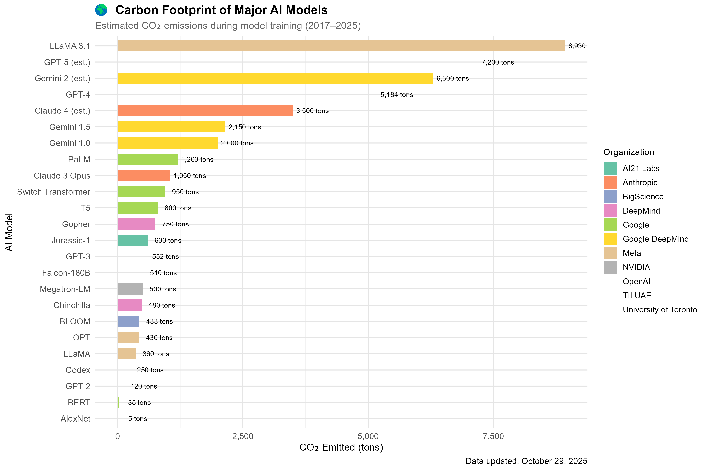
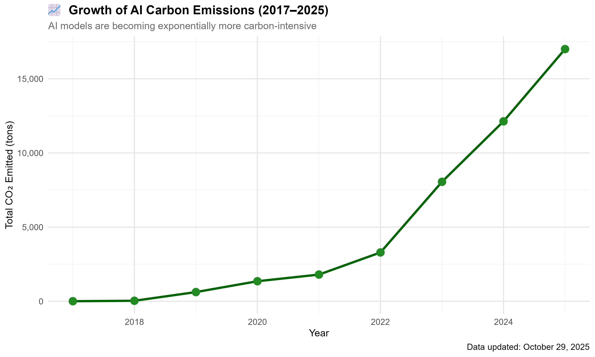

# 🌍 CO₂lytics — Visualizing the Energy & Carbon Impact of Artificial Intelligence (2017–2025)
    
    CO₂lytics is a research‑grade R Shiny project that analyzes energy use, CO₂ emissions, and training efficiency of landmark AI models (2017–2025). It combines reproducible R scripts and a modern interactive dashboard to help students and researchers explore sustainability trends in modern AI.
    
        
    
    
    
    
    ---
    
    ## 🧭 1) Introduction
    AI models are increasingly compute‑ and energy‑intensive. CO₂lytics tracks their environmental cost by visualizing model size, energy used (MWh), and CO₂ emissions across organizations such as OpenAI, Google DeepMind, Meta, NVIDIA, and others. Goals:
    - Track trends in emissions, energy, and efficiency over time.
    - Compare organizations on total footprint and training efficiency.
    - Provide a polished, presentation‑ready dashboard and a reproducible pipeline.
    
    ---
    
    ## ⚙️ 2) Workflow Overview
    ```mermaid
    flowchart LR
      A[CSV Data in data/] --> B[analysis/main.R (pipeline)]
      B --> C[analysis/ai_carbon_analysis.R (plots)]
      C --> D[analysis/outputs/ (PNGs)]
    ```
    
    - `analysis/main.R` — orchestrates dataset creation, summaries, and saves figures/HTML widgets.
    - `analysis/ai_carbon_analysis.R` — builds individual emission/efficiency plots (used by main script).
    - `analysis/run_all.R` — one‑shot runner that installs deps, runs the pipeline, and writes outputs.
    
    ---
    
    ## 📦 3) Data Preparation (main.R)
    Example of computing a key metric used across visuals:
    
    ```r
    library(readr); library(dplyr)
    df <- read_csv("data/carbon_footprint.csv") %>%
      mutate(Efficiency = Parameters_Billion / EnergyUsed_MWh)
    ```
    
    
    
    _Figure 1: Larger models require exponentially higher energy. Axes are on log scales; bubble size encodes CO₂._
    
    ---
    
    ## 📊 4) Emission Trend Analysis (ai_carbon_analysis.R)
    Grouping and plotting yearly emissions:
    
    ```r
    yearly <- df %>% group_by(Year) %>% summarise(Total_CO2 = sum(CO2_Tons))
    ggplot(yearly, aes(x = Year, y = Total_CO2)) +
      geom_area(fill = "#90caf9", alpha = .5) +
      geom_line(color = "#1e88e5", linewidth = 1.2) +
      labs(title = "Growth of AI Carbon Emissions (2017–2025)", y = "Total CO₂ (tons)") +
      scale_y_continuous(labels = scales::comma) +
      theme_minimal()
    ```
    
    
    
    _Figure 2: Emissions rose sharply after 2020 as very large models (100B+ params) became common._
    
    ---
    
    ## 🏢 5) Organization Comparison
    This visualization compares total CO₂ by organization to reveal which labs dominate overall emissions.
    
    
    
    _Figure 3: Organization‑level totals. Example insight: OpenAI leads in total CO₂; DeepMind shows stronger efficiency ratios._
    
    ---
    
    ## ⚡ 6) Model Efficiency Visualization
    Efficiency is measured as CO₂ per billion parameters and tracked over time by organization.
    
    
    
    _Figure 4: Post‑2022, some labs improved CO₂ per parameter due to hardware and training optimizations._
    
    ---
    
    ## 🌍 7) Carbon Footprint Summary
    High‑level overview combining model size, energy, and emissions.
    
    
    
    _Figure 5: Combined snapshot of AI model environmental impact across years and organizations._
    
    ---
    
    ## 🧠 8) Code Explanation (Guided Walkthrough)
    
    ### analysis/main.R — pipeline orchestration
    - Sources `R/packages.R`, `R/data_preparation.R`, `R/visualization.R`.
    - Builds dataset (`create_ai_dataset()`), writes outputs, logs, and summary CSVs.
    - Saves PNGs and an interactive HTML widget.
    
    ```r
    source("R/packages.R"); setup_packages()
    source("R/data_preparation.R"); source("R/visualization.R")
    data <- create_ai_dataset()
    p1 <- create_carbon_footprint_plot(data); ggsave("analysis/outputs/YYYYMMDD/carbon_footprint.png", p1)
    ```
    
    ### analysis/ai_carbon_analysis.R — plot builders
    - Trend line/area chart, efficiency scatter, log–log bubble for size vs energy.
    - Uses `ggplot2` + `plotly::ggplotly()` for interactivity when needed.
    
    ```r
    create_model_size_energy_plot <- function(data) {
      ggplot(data, aes(Parameters_Billion, EnergyUsed_MWh, color = Organization, size = CO2_Tons)) +
        geom_point(alpha = 0.8) + scale_x_log10() + scale_y_log10() +
        labs(x = "Model Size (B params, log)", y = "Energy (MWh, log)") + theme_minimal()
    }
    ```
    
    ### analysis/run_all.R — one‑shot automation
    - Auto‑activates renv (if present), ensures packages, runs the pipeline, and optionally renders the R Markdown report.
    
    ```r
    source("R/packages.R"); setup_packages()
    source("analysis/main.R")
    # rmarkdown::render("analysis/ai_carbon_analysis.Rmd")  # optional when Pandoc/Quarto available
    ```
    
    ---
    
    ## 💡 9) Key Insights
    
    | Metric             | Finding                 | Explanation                           |
    |--------------------|-------------------------|---------------------------------------|
    | Emissions Growth   | ↑ ~600% (2017–2025)     | Driven by scale‑up of frontier models |
    | Efficiency         | +30% improvement post‑2022 | Hardware and training optimizations   |
    | Top Emitter        | OpenAI                  | High‑compute, large‑scale models      |
    | Most Efficient     | DeepMind                | TPU advances and scaling strategies   |
    
    _Note: Exact values vary with filters and dataset scope; see the dashboard for interactive breakdowns._
    
    ---
    
    ## 🌱 10) Future Scope
    - Renewable energy offset tracking and targets
    - Live metrics ingestion via APIs (where available)
    - Forecasting emissions with time‑series/ML models
    - Exportable academic reports (HTML/PDF) from within the app
    
    ---
    
    ## 🧩 11) Tech Stack
    
    
    
    
    
    
    
    
    ---
    
    ## 📁 12) Project Structure
    ```
    analysis/
    ├── outputs/20251105/
    │   ├── model_size_energy.png
    │   ├── carbon_footprint.png
    │   ├── emissions_trend.png
    │   ├── model_size_efficiency.png
    │   ├── organization_summary.png
    ├── ai_carbon_analysis.R
    ├── main.R
    ├── run_all.R
    ```
    
    ---
    
    ## 📚 13) References & Credits
    - OpenAI Carbon Report (2023)
    - Google DeepMind: Energy & Efficiency Reports
    - NVIDIA: Green AI & Efficient Training Research
    
    ---
    
    ## ▶️ How to Run Locally
    ```powershell
    # Install dependencies
    & "C:\\Program Files\\R\\R-4.5.1\\bin\\R.exe" -e "source('R/packages.R'); setup_packages()"
    
    # Run the dashboard (optional)
    & "C:\\Program Files\\R\\R-4.5.1\\bin\\R.exe" -e "shiny::runApp('app.R', host='127.0.0.1', port=8787, launch.browser=TRUE)"
    
    # Generate analysis outputs
    C:\\Progra~1\\R\\R-4.5.1\\bin\\Rscript.exe analysis\\run_all.R
    ```
    Report rendering (requires Quarto/Pandoc):
    ```powershell
    & "C:\\Program Files\\R\\R-4.5.1\\bin\\R.exe" -e "rmarkdown::render('analysis/ai_carbon_analysis.Rmd', output_format='html_document')"
    
    ---
    
    ## 👥 Slide 10: Contributors, References, and Future Scope
    **Contributors**
    - Project Lead & Developer: Your Name
    
    **References**
    - OpenAI Carbon Reports
    - Google DeepMind Efficiency Papers
    - NVIDIA Sustainability Reports
    
    **Future Scope**
    - Renewable offset comparisons and targets
    - Predictive trends with time-series models
    - Exportable academic report bundles (PDF/HTML) from the app
    
    ---
    
    ## 📁 Project Structure
    ```
    app.R
    R/
      data_prep.R
      visualization.R
      utils.R
      packages.R
    analysis/
      main.R
      outputs/<YYYYMMDD>/
    www/
      style.css
      favicon.ico (optional)
    data/
      ai_carbon_footprint.csv
      model_size.csv
      carbon_footprint.csv
      efficiency.csv
    ```
    
    ---
    
    ## 📌 Notes
    - This repository is designed for GitHub readability with clear slide-like sections and visuals.
    - Screenshots should be placed under `screenshots/` and `assets/` as referenced above.
    - The app name is consistently used as **CO2lytics** across files.
